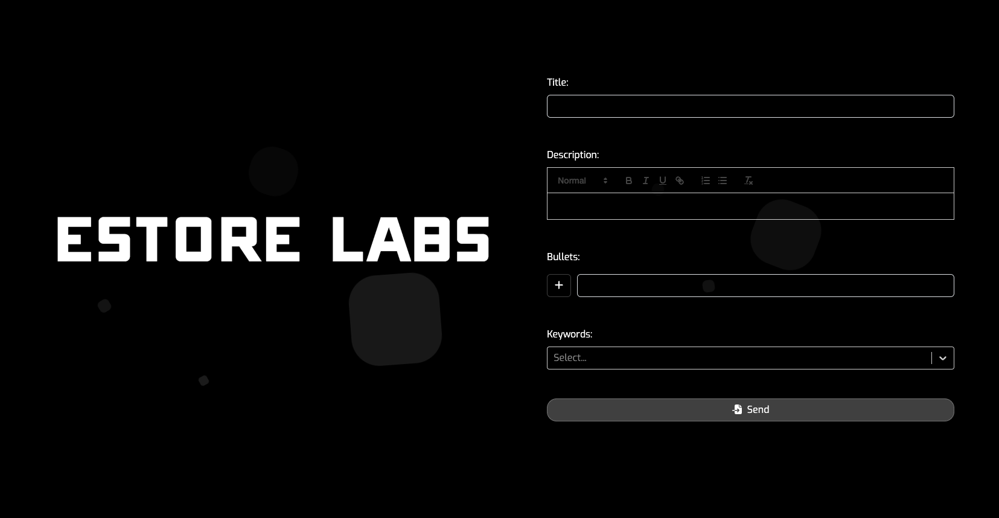

# ESTORE LABS Recruitment Task

This repository presents a recruitment task assigned by Estore Labs.

## Task Description

The application includes a simple form for users to fill out the following information:

- Title (using zod)
- Description (using quill)
- Bullets (using dnd)
- Keywords (using select)

All data, when correctly filled out, should be displayed in the console.

## Running the Application

To run the application, follow these steps:

1. Open the terminal and navigate to the main directory of the repository.
2. Run the `npm install` command to install the necessary Node.js packages.
3. After successful package installation, start the application by running the `npm start` command.

## Technologies Used

The application utilizes the following technologies:

- [react-hook-form](https://react-hook-form.com/)
- [react-select](https://react-select.com/)
- [react-bootstrap](https://react-bootstrap.github.io/)
- [zod](https://github.com/colinhacks/zod)
- [quill](https://quilljs.com/)
- [dnd (react-beautiful-dnd)](https://github.com/atlassian/react-beautiful-dnd)
- [Sass](https://sass-lang.com/)

## Contact

If you have any questions or need additional information, please feel free to reach out to me:

- Email: karol.komorowski@yahoo.com
- Phone: 796-331-543
